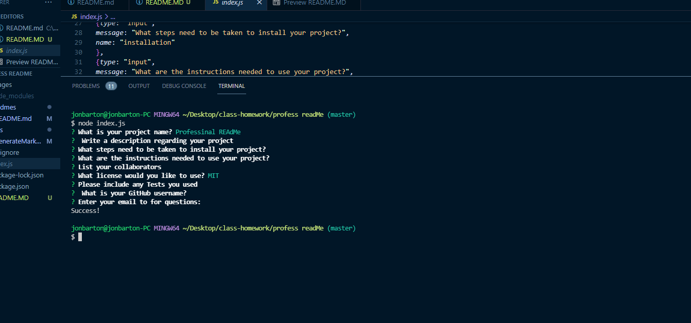

# Professional README
## Description
This project helped me create a simple program to create a README file for any future projects. 

## Installation
At this time this is not available to install, only can work on my local machine. 
## Usage
This must be used through the command line answering a series of questions and then will create a new readme file.
    ```
    
    ```
    [video link](https://drive.google.com/file/d/1PvsgoMdOseqEZyhzL5GlyPeQv9bP2BUn/view)
